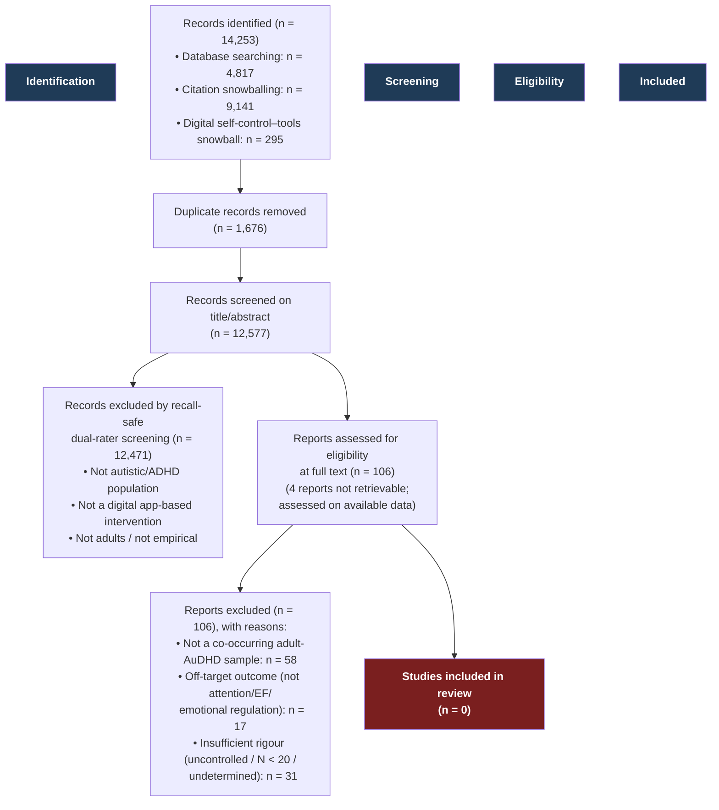

# PRISMA 2020 flow diagram



## Numbers used (reproducible from the pipeline)

| Stage | n |
|---|---|
| Records identified (all sources) | 14,253 |
| — Database searching | 4,817 |
| — Citation snowballing | 9,141 |
| — DSCT snowball (seed doi:10.1145/3571810) | 295 |
| Duplicates removed | 1,676 |
| Records screened (title/abstract) | 12,577 |
| Excluded at screening (recall-safe dual-rater) | 12,471 |
| Full-text reports assessed for eligibility | 106 (78 main arms + 28 DSCT referred) |
| — not retrievable (assessed on available data) | 4 |
| Full-text excluded — wrong population (not adult AuDHD) | 58 |
| Full-text excluded — off-target outcome | 17 |
| Full-text excluded — insufficient rigour | 31 |
| **Studies included** | **0** |

**Notes.** Screening was performed with a recall-safe, dual-rater AI protocol (Nova 2 Lite + Claude Sonnet 4.6): a record was excluded only when both raters agreed on an explicitly excluding value; "unspecified" judgments and disagreements were referred onward. Full-text exclusion categories pool the candidate-level decisions in `fulltext_review_master.csv` with the resolved DSCT-snowball referrals (`dsct_resolved.csv`); the 28 DSCT full-text referrals all failed on population (non-neurodivergent or excluded modality) and are counted under "wrong population."
```
